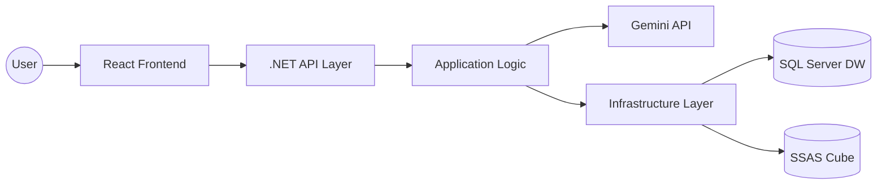

<div align="center">

# 🌌 OlapAnalytics: AI-Powered Multi-Dimensional Intelligence

[]()
[]()
[]()
[]()
[]()

</div>

**OlapAnalytics** là nền tảng Business Intelligence (BI) thế hệ mới, kết hợp sức mạnh của **Generative AI (Gemini)** với kiến trúc **OLAP (SSAS)** truyền thống. Hệ thống cho phép biến dữ liệu thô từ file Excel/CSV thành một kho dữ liệu (Data Warehouse) hoàn chỉnh và khối lập phương đa chiều (SSAS Cube) chỉ trong vài giây thông qua quy trình tự động hóa hoàn toàn.

<div align="center">
  
</div>

---

## 📖 Mục lục (Table of Contents)
- [✨ Giới thiệu](#-giới-thiệu)
- [🚀 Tính năng chính](#-tính-năng-chính)
- [🤖 Quy trình AI Thông minh (Advanced AI Pipeline)](#-quy-trình-ai-thông-minh-advanced-ai-pipeline)
- [🏗️ Kiến trúc hệ thống](#-kiến-trúc-hệ-thống)
- [🛠️ Hướng dẫn Cài đặt](#-hướng-dẫn-cài-đặt)
- [📖 Hướng dẫn Sử dụng](#-hướng-dẫn-sử-dụng)
- [💻 Công nghệ sử dụng](#-công-nghệ-sử-dụng)
- [🗺️ Lộ trình phát triển (Roadmap)](#-lộ-trình-phát-triển-roadmap)
- [🤝 Đóng góp](#-đóng-góp)
- [📄 Giấy phép](#-giấy-phép)

---

## ✨ Giới thiệu
Dự án giải quyết vấn đề phức tạp trong việc xây dựng hệ thống báo cáo đa chiều. Thông thường, việc thiết kế Star Schema và triển khai SSAS Cube mất nhiều ngày làm việc của Data Engineer. Với **OlapAnalytics**, mọi thứ được tự động hóa bởi AI, giúp doanh nghiệp tiếp cận dữ liệu phân tích ngay lập tức mà không cần kiến thức chuyên sâu về kỹ thuật OLAP.

---

## 🚀 Tính năng chính
- **🤖 AI-Driven Star Schema**: Tự động phân tích và thiết kế mô hình dữ liệu (Fact/Dimensions) từ file thô.
- **🔍 Auto-Discovery**: Tự động nhận diện và liệt kê SQL Server databases/SSAS catalogs ngay khi gõ tên máy chủ.
- **📊 Interactive Dashboard**: Biểu đồ Glassmorphism hiện đại với khả năng Drill-down sâu xuống từng cấp độ dữ liệu.
- **⚡ Smart Caching**: Cơ chế cache metadata và kết quả MDX thông minh, tối ưu hóa cho từng kết nối riêng biệt.
- **🌐 Multi-dimensional Filtering**: Bộ lọc thời gian nâng cao (Năm, Quý, Tháng, Ngày) tích hợp sẵn.

---

## 🤖 Quy trình AI Thông minh (Advanced AI Pipeline)
Hệ thống sử dụng mô hình **Gemini 1.5 Pro** tích hợp sâu vào quy trình ETL và OLAP Provisioning thông qua 5 giai đoạn tự động hóa:

### 1. Phân tích Ngữ nghĩa (Semantic Sampling)
- Hệ thống trích xuất 200 dòng dữ liệu đầu tiên để AI hiểu cấu trúc và kiểu dữ liệu.
- AI xác định vai trò của từng cột: `Measure` (chỉ tiêu đo lường), `Dimension` (chiều phân tích), hoặc `Key` (khóa liên kết).

### 2. Kỹ thuật Schema (Star Schema Engineering)
- AI tự động thiết kế mô hình **Star Schema** tối ưu:
  - Gom các thuộc tính văn bản vào các bảng **Dimension**.
  - Đưa các chỉ tiêu số và khóa ngoại vào bảng **Fact**.
  - Tự động tạo bảng **Dim_Date** để xử lý các thuộc tính thời gian.

### 3. Tự động hóa T-SQL & DDL
- Gemini sinh mã SQL hoàn chỉnh bao gồm:
  - Tạo Database và các bảng với khóa chính (PK) và khóa ngoại (FK) chuẩn xác.
  - Xử lý các kiểu dữ liệu (Data types) phù hợp nhất với SQL Server.

### 4. Pipeline Nạp dữ liệu (Smart Bulk Insert)
- Hệ thống thực hiện ánh xạ (Mapping) dữ liệu từ file thô vào các bảng SQL đã tạo.
- Thực hiện **Deduplication** (loại bỏ trùng lặp) cho các bảng Dimension để đảm bảo tính toàn vẹn dữ liệu.

### 5. Triển khai SSAS Cube (XMLA Deployment)
- Dựa trên Schema do AI thiết kế, hệ thống tự động sinh cấu trúc Cube (Measures, Dimensions, Hierarchies).
- Thực hiện **Process Cube** để người dùng có thể truy vấn ngay bằng ngôn ngữ MDX trên Dashboard.

<div align="center">
  
</div>

---

## 🏗️ Kiến trúc Hệ thống
Dự án được xây dựng theo chuẩn **Clean Architecture** để đảm bảo tính module và dễ kiểm thử:



---

## 🛠️ Hướng dẫn Cài đặt (Installation)

### 1. Yêu cầu hệ thống
- **Hệ điều hành**: Windows 10/11 (Cần thiết để chạy dịch vụ SSAS).
- **Môi trường**: 
  - .NET SDK 8.0+
  - Node.js 18+ (LTS)
  - SQL Server 2022 & Analysis Services (Multidimensional Mode).

### 2. Các bước thiết lập
1. **Clone project**:
   ```bash
   git clone https://github.com/username/olapanalytics.git
   cd olapanalytics
   ```
2. **Bật SQL & SSAS**: Đảm bảo các dịch vụ SQL Server và Analysis Services đã được khởi động.
3. **Cấu hình Gemini**: Đăng ký và lấy API Key tại [Google AI Studio](https://aistudio.google.com/).
4. **Khởi động nhanh**: Chạy lệnh duy nhất tại thư mục gốc:
   ```powershell
   node run.js
   ```

---

## 📖 Hướng dẫn Sử dụng (Usage)

### Bước 1: Cấu hình kết nối (Settings)
Truy cập trang **Cài đặt** (Settings), điền thông tin máy chủ. Sử dụng tính năng **Auto-Discovery** để chọn đúng Database và Catalog. Đừng quên lưu Gemini API Key.

### Bước 2: Tải dữ liệu & Phân tích (Upload)
Kéo thả file `.csv` hoặc `.xlsx` của bạn vào khu vực tải lên. Nhấn **Bắt đầu phân tích**. AI sẽ thực hiện toàn bộ quy trình thiết kế và nạp dữ liệu vào kho lưu trữ.

### Bước 3: Phân tích đa chiều (Dashboard)
Sử dụng các biểu đồ để xem tổng quan. Nhấn vào bất kỳ phần tử nào trên biểu đồ để thực hiện **Drill-down** (xem chi tiết ở cấp thấp hơn). Sử dụng bộ lọc ở sidebar để thay đổi góc nhìn.

---

## 💻 Công nghệ sử dụng (Tech Stack)
- **Frontend**: React 18, Vite, TypeScript, Vanilla CSS (Premium Glass UI).
- **Backend**: .NET 8, Dapper (SQL), Adomd.NET (MDX).
- **AI Engine**: Google Gemini 1.5 Pro.
- **Database/OLAP**: SQL Server, Analysis Services.

---

## 🗺️ Lộ trình phát triển (Roadmap)
- [x] Tích hợp AI Gemini thiết kế Schema tự động.
- [x] Cơ chế Drill-down đa cấp độ.
- [x] Auto-discovery cho SQL và SSAS.
- [ ] Hỗ trợ Export báo cáo ra PDF/Excel.
- [ ] AI Chatbot truy vấn dữ liệu bằng ngôn ngữ tự nhiên.
- [ ] Hỗ trợ Docker Deployment.

---

## 🤝 Đóng góp (Contributing)
Mọi ý tưởng và đóng góp đều được trân trọng!
1. Fork dự án.
2. Tạo nhánh tính năng mới (`git checkout -b feature/NewFeature`).
3. Commit và Push thay đổi.
4. Mở Pull Request để chúng tôi xem xét.

---

## 📄 Giấy phép (License)
Phát hành theo giấy phép **MIT**. Xem tệp `LICENSE` để biết thêm chi tiết.

---
🚀 **OlapAnalytics** - *Tầm nhìn dữ liệu, Quyết định tương lai.*
